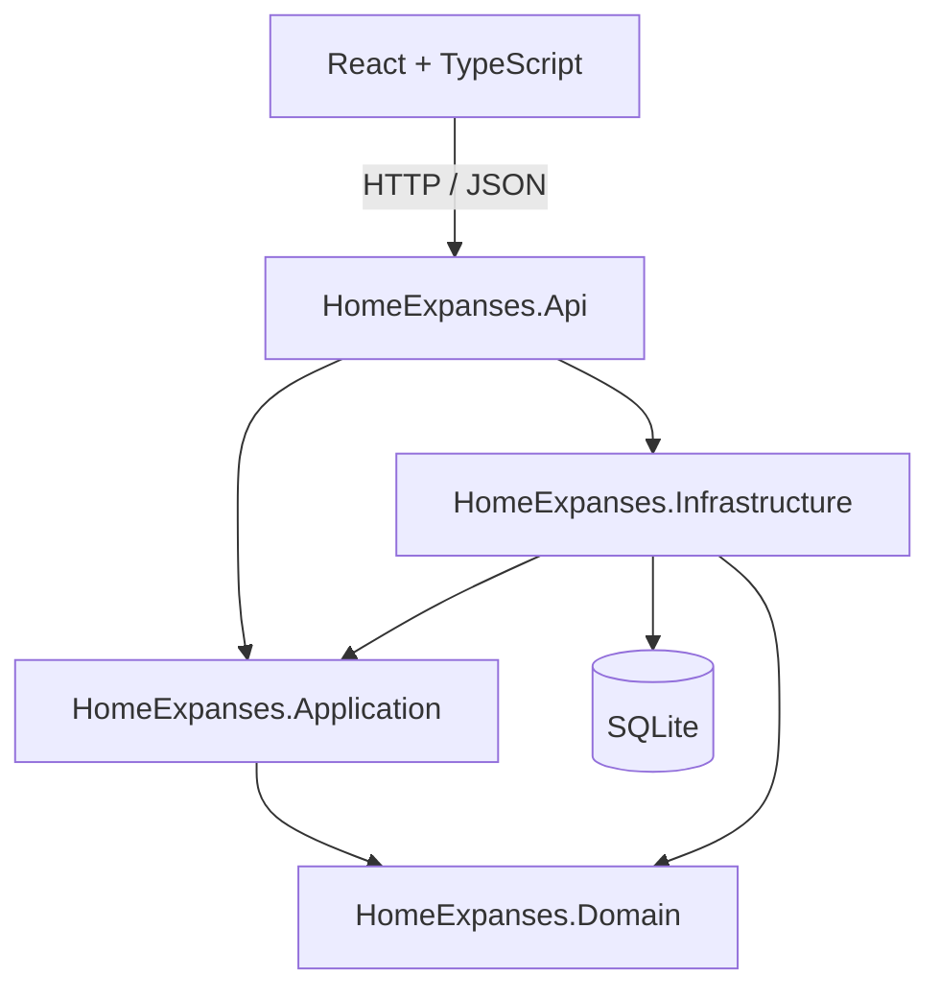
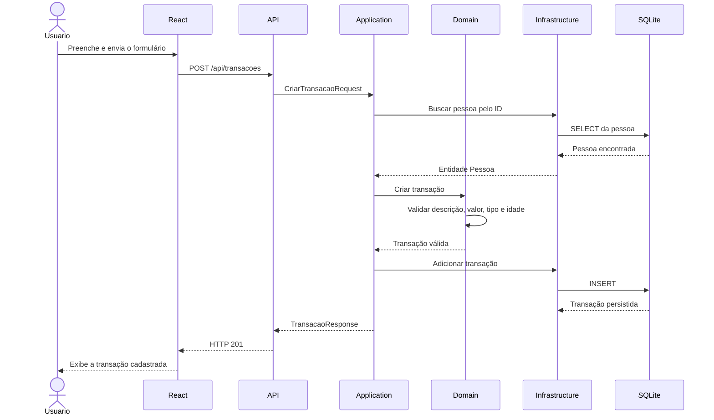

# HomeExpanses

Sistema full stack para controle de gastos residenciais, desenvolvido com ASP.NET Core, React, TypeScript, Entity Framework Core e SQLite.

A aplicação permite cadastrar pessoas, registrar receitas e despesas e consultar os totais financeiros individuais e gerais da residência.

Meu objetivo com este projeto não foi apenas criar telas e endpoints que funcionassem. Eu também busquei organizar o código de uma maneira que deixasse as regras de negócio separadas dos detalhes técnicos, facilitando a manutenção, os testes e uma possível troca do banco de dados no futuro.

---

## Sumário

* [Sobre o projeto](#sobre-o-projeto)
* [Funcionalidades](#funcionalidades)
* [Regras de negócio](#regras-de-negócio)
* [Tecnologias utilizadas](#tecnologias-utilizadas)
* [Arquitetura](#arquitetura)
* [Fluxo de uma requisição](#fluxo-de-uma-requisição)
* [Estrutura do projeto](#estrutura-do-projeto)
* [Decisões técnicas](#decisões-técnicas)
* [Pré-requisitos](#pré-requisitos)
* [Como executar o projeto](#como-executar-o-projeto)
* [Como utilizar o sistema](#como-utilizar-o-sistema)
* [Endpoints da API](#endpoints-da-api)
* [Exemplos de requisições](#exemplos-de-requisições)
* [Persistência dos dados](#persistência-dos-dados)
* [Migrations](#migrations)
* [Como trocar o banco de dados](#como-trocar-o-banco-de-dados)
* [Validações e tratamento de erros](#validações-e-tratamento-de-erros)
* [Testes manuais recomendados](#testes-manuais-recomendados)
* [Comandos de validação](#comandos-de-validação)
* [Problemas comuns](#problemas-comuns)
* [Limites do escopo](#limites-do-escopo)
* [Possíveis melhorias](#possíveis-melhorias)
* [Autor](#autor)

---

## Sobre o projeto

O HomeExpanses é uma aplicação para gerenciamento de gastos residenciais.

O sistema trabalha com três áreas principais:

1. Cadastro de pessoas;
2. Cadastro de transações;
3. Consulta de totais.

Cada transação precisa estar vinculada a uma pessoa cadastrada. Dessa forma, o sistema consegue calcular quanto cada pessoa recebeu, quanto gastou e qual é o seu saldo atual.

Também existe uma regra específica para menores de idade: pessoas com menos de 18 anos podem cadastrar despesas, mas não podem cadastrar receitas.

A aplicação foi dividida em um back-end responsável pelas regras de negócio e pela persistência dos dados, e um front-end responsável pela interação com o usuário.

---

## Funcionalidades

### Pessoas

* Cadastrar uma pessoa;
* Listar todas as pessoas cadastradas;
* Consultar uma pessoa pelo identificador;
* Excluir uma pessoa;
* Excluir automaticamente todas as transações relacionadas à pessoa removida.

### Transações

* Cadastrar uma transação;
* Listar todas as transações;
* Vincular cada transação a uma pessoa existente;
* Registrar transações do tipo despesa ou receita;
* Impedir o cadastro de receitas para pessoas menores de 18 anos.

### Totais

* Consultar o total de receitas de cada pessoa;
* Consultar o total de despesas de cada pessoa;
* Calcular o saldo de cada pessoa;
* Consultar o total geral de receitas;
* Consultar o total geral de despesas;
* Calcular o saldo líquido de toda a residência.

---

## Regras de negócio

As principais regras implementadas no sistema são:

* O identificador da pessoa é único e gerado automaticamente;
* O nome da pessoa é obrigatório;
* A idade deve estar entre 0 e 120 anos;
* O identificador da transação é único e gerado automaticamente;
* A descrição da transação é obrigatória;
* O valor da transação deve ser maior que zero;
* O tipo da transação deve ser `Despesa` ou `Receita`;
* Toda transação precisa estar vinculada a uma pessoa existente;
* Pessoas menores de 18 anos só podem cadastrar despesas;
* Ao excluir uma pessoa, todas as transações vinculadas a ela também são excluídas;
* O saldo é calculado utilizando a fórmula:

```text
Saldo = Total de receitas - Total de despesas
```

Essas regras são validadas principalmente no back-end.

O front-end também realiza algumas validações para melhorar a experiência do usuário, mas ele não é considerado a fonte principal de segurança das regras. Uma requisição poderia ser enviada diretamente para a API sem passar pelo React, por isso as regras obrigatórias permanecem protegidas no servidor.

---

## Tecnologias utilizadas

### Back-end

* C#;
* .NET;
* ASP.NET Core Web API;
* Entity Framework Core;
* SQLite;
* LINQ;
* OpenAPI;
* Injeção de dependência.

### Front-end

* React;
* TypeScript;
* Vite;
* Fetch API;
* HTML;
* CSS.

### Desenvolvimento

* Git;
* GitHub;
* Visual Studio Code ou Visual Studio;
* npm;
* .NET CLI;
* Entity Framework CLI.

---

## Arquitetura

No back-end, optei por uma arquitetura em camadas inspirada em Clean Architecture.

A intenção principal dessa separação é impedir que as regras de negócio dependam diretamente do banco de dados, do Entity Framework ou da própria API.



A direção principal das dependências é:

```text
Domain
   ↑
Application
   ↑
Infrastructure

API → Application
API → Infrastructure
```

O projeto de domínio não depende de nenhuma outra camada.

A camada de aplicação depende somente do domínio e das abstrações definidas por ela mesma.

A infraestrutura conhece essas abstrações e fornece as implementações que utilizam Entity Framework Core e SQLite.

A API funciona como o ponto de entrada e também como o local em que as dependências são conectadas.

### Domain

O projeto `HomeExpanses.Domain` representa o núcleo do sistema.

Ele contém:

* Entidade `Pessoa`;
* Entidade `Transacao`;
* Enum `TipoTransacao`;
* Exceções de regra de negócio;
* Validações fundamentais;
* Regra que impede receitas para menores.

O Domain não conhece:

* Controllers;
* HTTP;
* JSON;
* Entity Framework;
* SQLite;
* React;
* Vite.

Isso significa que as regras continuam válidas mesmo que a forma de acesso ou a tecnologia de persistência seja alterada.

### Application

O projeto `HomeExpanses.Application` contém os casos de uso do sistema.

Exemplos:

* Criar uma pessoa;
* Listar pessoas;
* Excluir uma pessoa;
* Criar uma transação;
* Listar transações;
* Consultar os totais.

Essa camada coordena as operações, mas não sabe como os dados são armazenados.

Ela trabalha com interfaces, como:

```text
IPessoaRepository
ITransacaoRepository
ITotaisRepository
IUnitOfWork
```

Essas interfaces representam aquilo que a aplicação precisa fazer com os dados, sem determinar qual banco ou biblioteca deve ser usada.

### Infrastructure

O projeto `HomeExpanses.Infrastructure` contém os detalhes técnicos.

Ele é responsável por:

* Configuração do Entity Framework Core;
* Configuração do SQLite;
* `AppDbContext`;
* Mapeamento das entidades;
* Implementação dos repositórios;
* Migrations;
* Exclusão em cascata;
* Execução das consultas no banco.

Se o SQLite for trocado por SQL Server ou PostgreSQL, a maior parte das mudanças deverá ficar concentrada nessa camada.

### API

O projeto `HomeExpanses.Api` expõe os casos de uso por HTTP.

Ele contém:

* Controllers;
* Rotas;
* Configuração de CORS;
* Serialização JSON;
* Tratamento global de exceções;
* OpenAPI;
* Configuração da aplicação;
* Registro das dependências.

Os controllers foram mantidos pequenos. Eles recebem a requisição, chamam um serviço da Application e devolvem a resposta HTTP.

### Front-end

O front-end foi separado por responsabilidades:

* `api`: comunicação HTTP genérica;
* `services`: endpoints específicos;
* `types`: contratos TypeScript;
* `pages`: telas principais;
* `components`: elementos reutilizáveis;
* `utils`: funções auxiliares.

Essa organização evita que as páginas precisem conhecer todos os detalhes do `fetch`, das URLs e do tratamento de respostas HTTP.

---

## Fluxo de uma requisição

Ao cadastrar uma transação, o fluxo acontece da seguinte forma:



Esse fluxo separa claramente quatro tipos de responsabilidade:

```text
Interface do usuário → React
Comunicação HTTP     → API
Caso de uso           → Application
Regra de negócio      → Domain
Persistência          → Infrastructure
```

---

## Estrutura do projeto

```text
HomeExpanses/
├── backend/
│   ├── HomeExpanses.Domain/
│   │   ├── Entities/
│   │   │   ├── Pessoa.cs
│   │   │   └── Transacao.cs
│   │   ├── Enums/
│   │   │   └── TipoTransacao.cs
│   │   └── Exceptions/
│   │       └── RegraNegocioException.cs
│   │
│   ├── HomeExpanses.Application/
│   │   ├── Abstractions/
│   │   │   ├── Persistence/
│   │   │   └── Services/
│   │   ├── DTOs/
│   │   │   ├── Pessoas/
│   │   │   ├── Transacoes/
│   │   │   └── Totais/
│   │   ├── Exceptions/
│   │   ├── Services/
│   │   └── DependencyInjection.cs
│   │
│   ├── HomeExpanses.Infrastructure/
│   │   ├── Persistence/
│   │   │   ├── Configurations/
│   │   │   ├── Migrations/
│   │   │   ├── Repositories/
│   │   │   ├── AppDbContext.cs
│   │   │   └── DatabaseInitializer.cs
│   │   └── DependencyInjection.cs
│   │
│   └── HomeExpanses.Api/
│       ├── Controllers/
│       ├── ErrorHandling/
│       ├── Properties/
│       ├── Program.cs
│       └── appsettings.json
│
├── frontend/
│   ├── src/
│   │   ├── api/
│   │   ├── components/
│   │   ├── pages/
│   │   ├── services/
│   │   ├── types/
│   │   ├── utils/
│   │   ├── App.tsx
│   │   ├── index.css
│   │   └── main.tsx
│   ├── .env.example
│   ├── index.html
│   ├── package.json
│   ├── package-lock.json
│   └── vite.config.ts
│
├── HomeExpanses.sln
├── README.md
└── .gitignore
```

---

## Decisões técnicas

### Separação em projetos

Eu preferi criar projetos separados para Domain, Application, Infrastructure e API, em vez de apenas criar pastas dentro de uma única Web API.

As referências entre projetos criam uma barreira real no código. Por exemplo, o Domain não possui referência para Infrastructure, então ele não consegue utilizar acidentalmente o `AppDbContext`.

Isso torna a separação mais clara e mais difícil de ser quebrada sem intenção.

### Repository

Os repositórios isolam as operações de persistência.

A Application solicita operações como:

```text
Listar pessoas
Buscar pessoa pelo ID
Adicionar uma transação
Consultar totais
```

A implementação concreta dessas operações fica na Infrastructure.

Não utilizei um repositório genérico porque as necessidades de uma pessoa, de uma transação e da consulta de totais são diferentes. Interfaces específicas deixam as intenções mais claras.

### Unit of Work

O `AppDbContext` também implementa `IUnitOfWork`.

Os repositórios registram as alterações e o Unit of Work confirma essas alterações por meio de:

```csharp
SaveChangesAsync()
```

Dessa maneira, a Application não precisa depender diretamente do Entity Framework.

### DTOs

As entidades do Domain não são recebidas ou devolvidas diretamente pela API.

Foram criados DTOs específicos, como:

```text
CriarPessoaRequest
PessoaResponse
CriarTransacaoRequest
TransacaoResponse
ConsultaTotaisResponse
```

Isso evita que o cliente controle propriedades internas, como o identificador gerado pelo banco ou as propriedades de navegação do Entity Framework.

Também impede que mudanças internas nas entidades alterem automaticamente o contrato HTTP.

### Valores monetários em centavos

Internamente, os valores são armazenados como números inteiros de centavos.

Exemplos:

```text
R$ 1,00     → 100
R$ 10,50    → 1050
R$ 3.500,00 → 350000
```

A API recebe e devolve valores decimais normalmente, mas o Domain converte esses valores para centavos antes da persistência.

Essa escolha evita problemas de precisão e também reduz dependências relacionadas à forma como cada banco representa valores decimais.

A propriedade pública `Valor` converte os centavos novamente:

```text
Valor = ValorEmCentavos / 100
```

### Exclusão em cascata

A relação entre pessoas e transações foi configurada com exclusão em cascata.

Isso significa que, quando uma pessoa é removida, o próprio banco também remove suas transações.

A regra está configurada na Infrastructure porque o comportamento de chave estrangeira pertence ao modelo de persistência.

### Enum como texto

O tipo da transação é representado no código por um enum:

```csharp
Despesa
Receita
```

No banco e no JSON, os valores são tratados como texto.

Isso torna os dados mais legíveis e evita depender diretamente dos valores numéricos internos do enum.

### Tratamento global de exceções

As exceções são tratadas por um manipulador global.

O mapeamento principal é:

```text
Regra de negócio inválida     → HTTP 400
Recurso não encontrado        → HTTP 404
Erro inesperado               → HTTP 500
```

Com isso, os controllers não precisam repetir blocos de `try/catch`.

As respostas seguem um formato previsível e podem incluir um `traceId` para facilitar a localização de erros nos logs.

### Cliente HTTP centralizado

No React, as páginas não utilizam `fetch` diretamente.

A comunicação fica centralizada em:

```text
src/api/httpClient.ts
```

Esse arquivo é responsável por:

* Montar a URL;
* Configurar os headers;
* Serializar e interpretar JSON;
* Verificar o status HTTP;
* Tratar erros de conexão;
* Interpretar respostas de validação da API.

Os services utilizam esse cliente para expor operações mais simples às páginas.

Exemplo:

```typescript
pessoasService.listar();
pessoasService.criar(request);
pessoasService.excluir(id);
```

---

## Pré-requisitos

Antes de executar o projeto, é necessário possuir:

* Git;
* .NET SDK compatível com o projeto;
* Node.js LTS;
* npm;
* Ferramenta `dotnet-ef`.

Confirme as instalações:

```bash
git --version
dotnet --version
node --version
npm --version
```

Para verificar o Entity Framework CLI:

```bash
dotnet ef --version
```

Caso a ferramenta ainda não esteja instalada:

```bash
dotnet tool install --global dotnet-ef
```

Caso já esteja instalada e precise ser atualizada:

```bash
dotnet tool update --global dotnet-ef
```

---

## Como executar o projeto

### 1. Clonar o repositório

```bash
git clone https://github.com/SEU-USUARIO/HomeExpanses.git
```

Entre na pasta:

```bash
cd HomeExpanses
```

Substitua `SEU-USUARIO` pelo usuário correto do GitHub.

### 2. Restaurar as dependências do back-end

Na raiz do repositório:

```bash
dotnet restore
```

Esse comando lê os arquivos `.csproj` e baixa os pacotes NuGet necessários.

### 3. Compilar o back-end

```bash
dotnet build
```

O resultado esperado é:

```text
Build succeeded.
```

### 4. Verificar as migrations

As migrations ficam em:

```text
backend/HomeExpanses.Infrastructure/Persistence/Migrations
```

Para listar as migrations existentes:

```bash
dotnet ef migrations list --project backend/HomeExpanses.Infrastructure/HomeExpanses.Infrastructure.csproj --startup-project backend/HomeExpanses.Api/HomeExpanses.Api.csproj
```

### 5. Atualizar o banco manualmente

A aplicação está configurada para aplicar migrations pendentes durante a inicialização.

Mesmo assim, também é possível atualizar o banco manualmente:

```bash
dotnet ef database update --project backend/HomeExpanses.Infrastructure/HomeExpanses.Infrastructure.csproj --startup-project backend/HomeExpanses.Api/HomeExpanses.Api.csproj
```

### 6. Executar o back-end

```bash
dotnet run --project backend/HomeExpanses.Api/HomeExpanses.Api.csproj
```

A API será disponibilizada em:

```text
http://localhost:5080
```

Mantenha esse terminal aberto.

### 7. Configurar o front-end

Abra outro terminal e entre na pasta do front-end:

```bash
cd frontend
```

Crie o arquivo `.env` a partir do exemplo.

No PowerShell:

```powershell
Copy-Item .env.example .env
```

No Linux ou macOS:

```bash
cp .env.example .env
```

O conteúdo esperado é:

```env
VITE_API_URL=http://localhost:5080/api
```

### 8. Instalar as dependências do front-end

```bash
npm install
```

Esse comando cria a pasta `node_modules` com as dependências definidas no `package.json`.

### 9. Executar o front-end

```bash
npm run dev
```

A interface será disponibilizada em:

```text
http://localhost:5173
```

### 10. Abrir a aplicação

Com o back-end e o front-end em execução, acesse:

```text
http://localhost:5173
```

É necessário manter os dois terminais abertos:

```text
Terminal 1 → API ASP.NET Core
Terminal 2 → React com Vite
```

---

## Como utilizar o sistema

### Cadastrar uma pessoa

1. Abra a área `Pessoas`;
2. Informe o nome;
3. Informe a idade;
4. Clique em `Cadastrar pessoa`;
5. A pessoa aparecerá na tabela de pessoas cadastradas.

O identificador é criado automaticamente pelo banco.

### Excluir uma pessoa

1. Abra a área `Pessoas`;
2. Localize a pessoa;
3. Clique em `Excluir`;
4. Confirme a operação.

Ao confirmar, a pessoa e todas as suas transações serão removidas.

Essa operação não pode ser desfeita pela interface.

### Cadastrar uma transação

1. Abra a área `Transações`;
2. Informe a descrição;
3. Informe o valor;
4. Selecione a pessoa;
5. Escolha entre `Despesa` e `Receita`;
6. Clique em `Cadastrar transação`.

Caso a pessoa selecionada seja menor de 18 anos, a opção Receita ficará desabilitada.

Mesmo que alguém tente enviar a requisição diretamente para a API, o back-end também bloqueará a operação.

### Consultar os totais

1. Abra a área `Totais`;
2. O sistema exibirá:

   * Total de receitas por pessoa;
   * Total de despesas por pessoa;
   * Saldo por pessoa;
   * Total geral de receitas;
   * Total geral de despesas;
   * Saldo líquido geral.
3. Utilize o botão `Atualizar totais` para consultar novamente a API.

Uma pessoa sem transações também aparecerá na listagem, com os valores zerados.

---

## Endpoints da API

| Método   | Endpoint            | Descrição                               |
| -------- | ------------------- | --------------------------------------- |
| `GET`    | `/api/pessoas`      | Lista todas as pessoas                  |
| `GET`    | `/api/pessoas/{id}` | Consulta uma pessoa pelo ID             |
| `POST`   | `/api/pessoas`      | Cadastra uma pessoa                     |
| `DELETE` | `/api/pessoas/{id}` | Exclui uma pessoa e suas transações     |
| `GET`    | `/api/transacoes`   | Lista todas as transações               |
| `POST`   | `/api/transacoes`   | Cadastra uma transação                  |
| `GET`    | `/api/totais`       | Consulta os totais individuais e gerais |

A URL base utilizada no ambiente de desenvolvimento é:

```text
http://localhost:5080/api
```

---

## Exemplos de requisições

### Cadastrar uma pessoa adulta

```http
POST /api/pessoas
Content-Type: application/json
```

```json
{
  "nome": "Carlos",
  "idade": 32
}
```

Resposta esperada:

```http
HTTP/1.1 201 Created
```

```json
{
  "id": 1,
  "nome": "Carlos",
  "idade": 32
}
```

### Cadastrar uma pessoa menor

```http
POST /api/pessoas
Content-Type: application/json
```

```json
{
  "nome": "Ana",
  "idade": 16
}
```

### Cadastrar uma receita para adulto

```http
POST /api/transacoes
Content-Type: application/json
```

```json
{
  "descricao": "Salário",
  "valor": 3500.00,
  "tipo": "Receita",
  "pessoaId": 1
}
```

### Cadastrar uma despesa

```http
POST /api/transacoes
Content-Type: application/json
```

```json
{
  "descricao": "Aluguel",
  "valor": 1200.00,
  "tipo": "Despesa",
  "pessoaId": 1
}
```

### Tentativa de receita para menor

```http
POST /api/transacoes
Content-Type: application/json
```

```json
{
  "descricao": "Receita inválida",
  "valor": 200.00,
  "tipo": "Receita",
  "pessoaId": 2
}
```

Resposta esperada:

```http
HTTP/1.1 400 Bad Request
```

Exemplo de corpo:

```json
{
  "status": 400,
  "title": "Regra de negócio inválida",
  "detail": "Pessoas menores de 18 anos não podem cadastrar receitas.",
  "instance": "/api/transacoes"
}
```

### Consultar totais

```http
GET /api/totais
Accept: application/json
```

Exemplo de resposta:

```json
{
  "pessoas": [
    {
      "pessoaId": 2,
      "nome": "Ana",
      "totalReceitas": 0,
      "totalDespesas": 150,
      "saldo": -150
    },
    {
      "pessoaId": 1,
      "nome": "Carlos",
      "totalReceitas": 3500,
      "totalDespesas": 1200,
      "saldo": 2300
    }
  ],
  "totalGeral": {
    "totalReceitas": 3500,
    "totalDespesas": 1350,
    "saldo": 2150
  }
}
```

---

## Persistência dos dados

O projeto utiliza SQLite.

Diferentemente de uma lista mantida somente na memória, o SQLite grava os dados em um arquivo físico.

Isso significa que os registros permanecem salvos quando a aplicação é encerrada.

A conexão é configurada no arquivo:

```text
backend/HomeExpanses.Api/appsettings.json
```

Exemplo:

```json
{
  "Database": {
    "Provider": "Sqlite"
  },
  "ConnectionStrings": {
    "DefaultConnection": "Data Source=home-expanses.db"
  }
}
```

O nome exato do arquivo pode variar conforme a configuração do projeto.

O arquivo do banco não precisa ser enviado para o Git. O esquema pode ser recriado por meio das migrations.

---

## Migrations

As migrations registram as mudanças realizadas no modelo do Entity Framework.

Quando uma entidade ou configuração é alterada, é necessário criar uma nova migration.

Exemplos de mudanças que exigem migration:

* Adicionar uma propriedade;
* Remover uma propriedade;
* Alterar o tamanho máximo de uma coluna;
* Criar um relacionamento;
* Alterar uma chave estrangeira;
* Mudar o tipo persistido;
* Alterar o comportamento de exclusão.

### Criar uma nova migration

```bash
dotnet ef migrations add NomeDaAlteracao --project backend/HomeExpanses.Infrastructure/HomeExpanses.Infrastructure.csproj --startup-project backend/HomeExpanses.Api/HomeExpanses.Api.csproj --output-dir Persistence/Migrations
```

Exemplo:

```bash
dotnet ef migrations add AddTransactionRelationship --project backend/HomeExpanses.Infrastructure/HomeExpanses.Infrastructure.csproj --startup-project backend/HomeExpanses.Api/HomeExpanses.Api.csproj --output-dir Persistence/Migrations
```

### Aplicar migrations

```bash
dotnet ef database update --project backend/HomeExpanses.Infrastructure/HomeExpanses.Infrastructure.csproj --startup-project backend/HomeExpanses.Api/HomeExpanses.Api.csproj
```

### Verificar alterações pendentes

```bash
dotnet ef migrations has-pending-model-changes --project backend/HomeExpanses.Infrastructure/HomeExpanses.Infrastructure.csproj --startup-project backend/HomeExpanses.Api/HomeExpanses.Api.csproj
```

A sequência correta depois de alterar o modelo é:

```text
Alterar a entidade ou configuração
            ↓
Criar uma migration
            ↓
Revisar o código gerado
            ↓
Aplicar a migration
            ↓
Executar e testar a aplicação
```

As migrations devem ser versionadas no Git.

O arquivo `.db` não deve ser versionado.

---

## Como trocar o banco de dados

A escolha do banco está isolada principalmente na camada Infrastructure.

Atualmente, o provider utilizado é o SQLite:

```csharp
options.UseSqlite(connectionString);
```

Para utilizar outro banco, como SQL Server ou PostgreSQL, seria necessário:

1. Instalar o provider correspondente;
2. Alterar a configuração do `DbContext`;
3. Alterar a string de conexão;
4. Criar migrations específicas para o novo provider;
5. Testar as consultas e os relacionamentos.

### Exemplo com SQL Server

Instalar o pacote:

```bash
dotnet add backend/HomeExpanses.Infrastructure/HomeExpanses.Infrastructure.csproj package Microsoft.EntityFrameworkCore.SqlServer
```

Configurar o provider:

```csharp
options.UseSqlServer(connectionString);
```

Exemplo de configuração:

```json
{
  "Database": {
    "Provider": "SqlServer"
  },
  "ConnectionStrings": {
    "DefaultConnection": "Server=localhost;Database=HomeExpanses;Trusted_Connection=True;TrustServerCertificate=True"
  }
}
```

### Partes que não deveriam precisar de alteração

```text
HomeExpanses.Domain
HomeExpanses.Application
Controllers
DTOs
Regras de negócio
Interfaces dos repositórios
Front-end
```

### Partes que podem precisar de alteração

```text
Pacote do Entity Framework
Configuração da Infrastructure
String de conexão
Migrations
Consultas específicas do provider
```

A arquitetura reduz o impacto da troca, mas não elimina a necessidade de testar o comportamento do novo banco.

---

## Validações e tratamento de erros

O sistema possui validações em mais de um nível.

### Front-end

O React valida:

* Campos obrigatórios;
* Limites de idade;
* Valor maior que zero;
* Descrição mínima;
* Pessoa selecionada;
* Restrição visual de receitas para menores.

Essas validações fornecem um retorno rápido para o usuário.

### DTOs da API

Os DTOs validam:

* Campos obrigatórios;
* Tamanho dos textos;
* Intervalos numéricos;
* Valores do enum;
* Identificadores positivos.

Quando o modelo recebido é inválido, a API devolve HTTP 400.

### Domain

As entidades também validam suas próprias regras.

Isso impede a criação de objetos inválidos mesmo quando a operação não passa pelo front-end.

### Banco de dados

O banco protege:

* Chaves primárias;
* Chaves estrangeiras;
* Campos obrigatórios;
* Relacionamentos;
* Exclusão em cascata.

### Códigos HTTP principais

| Código | Significado no projeto                   |
| ------ | ---------------------------------------- |
| `200`  | Consulta realizada com sucesso           |
| `201`  | Recurso criado com sucesso               |
| `204`  | Exclusão realizada sem corpo de resposta |
| `400`  | Dados ou regra de negócio inválidos      |
| `404`  | Recurso não encontrado                   |
| `500`  | Erro inesperado no servidor              |

---

## Testes manuais recomendados

### Pessoas

* Cadastrar uma pessoa adulta;
* Cadastrar uma pessoa menor;
* Tentar cadastrar um nome vazio;
* Tentar cadastrar idade negativa;
* Tentar cadastrar idade superior a 150;
* Consultar uma pessoa existente;
* Consultar uma pessoa inexistente;
* Excluir uma pessoa existente;
* Tentar excluir uma pessoa inexistente.

### Transações

* Cadastrar receita para adulto;
* Cadastrar despesa para adulto;
* Cadastrar despesa para menor;
* Tentar cadastrar receita para menor;
* Tentar cadastrar transação para pessoa inexistente;
* Tentar cadastrar valor zero;
* Tentar cadastrar valor negativo;
* Tentar cadastrar descrição vazia;
* Tentar enviar um tipo inválido.

### Exclusão em cascata

1. Cadastre uma pessoa;
2. Cadastre duas transações para essa pessoa;
3. Confirme que as transações aparecem na listagem;
4. Exclua a pessoa;
5. Consulte novamente as transações;
6. Confirme que as duas transações foram removidas.

### Totais

Considere os seguintes dados:

```text
Carlos
Receita: R$ 3.500,00
Despesa: R$ 1.200,00

Ana
Despesa: R$ 150,00
```

Resultado esperado:

```text
Carlos
Receitas: R$ 3.500,00
Despesas: R$ 1.200,00
Saldo: R$ 2.300,00

Ana
Receitas: R$ 0,00
Despesas: R$ 150,00
Saldo: -R$ 150,00

Total geral
Receitas: R$ 3.500,00
Despesas: R$ 1.350,00
Saldo: R$ 2.150,00
```

### Persistência

1. Cadastre pessoas e transações;
2. Encerre a API;
3. Execute a API novamente;
4. Consulte as pessoas e transações;
5. Confirme que os registros continuam armazenados.

---

## Comandos de validação

### Restaurar o back-end

```bash
dotnet restore
```

### Compilar o back-end

```bash
dotnet build
```

### Executar testes do .NET

```bash
dotnet test
```

### Instalar dependências do front-end

```bash
cd frontend
npm install
```

### Executar o lint

```bash
npm run lint
```

### Gerar o build do front-end

```bash
npm run build
```

### Executar a versão compilada localmente

```bash
npm run preview
```

Antes de publicar uma nova versão, a sequência recomendada é:

```bash
dotnet build
dotnet test
cd frontend
npm run lint
npm run build
```

---

## Problemas comuns

### A API informa que existem mudanças pendentes no modelo

Mensagem semelhante:

```text
The model for context 'AppDbContext' has pending changes.
Add a new migration before updating the database.
```

Isso significa que alguma entidade ou configuração foi alterada depois da última migration.

Crie uma nova migration:

```bash
dotnet ef migrations add SyncCurrentModel --project backend/HomeExpanses.Infrastructure/HomeExpanses.Infrastructure.csproj --startup-project backend/HomeExpanses.Api/HomeExpanses.Api.csproj --output-dir Persistence/Migrations
```

Depois aplique:

```bash
dotnet ef database update --project backend/HomeExpanses.Infrastructure/HomeExpanses.Infrastructure.csproj --startup-project backend/HomeExpanses.Api/HomeExpanses.Api.csproj
```

Não é recomendado ignorar esse aviso, porque ele indica que o modelo do código e o banco estão diferentes.

### O front-end não consegue conectar à API

Verifique:

* Se a API está em execução;
* Se a API está utilizando a porta `5080`;
* Se o `.env` contém a URL correta;
* Se o front-end foi reiniciado depois de alterar o `.env`;
* Se não existe bloqueio de firewall;
* Se o CORS permite `http://localhost:5173`.

Conteúdo esperado do `.env`:

```env
VITE_API_URL=http://localhost:5080/api
```

### Erro de CORS

Verifique se o back-end possui uma política semelhante a:

```csharp
policy
    .WithOrigins("http://localhost:5173")
    .AllowAnyHeader()
    .AllowAnyMethod();
```

O endereço precisa corresponder exatamente ao endereço do front-end.

### O Vite iniciou em outra porta

A configuração utiliza:

```typescript
server: {
  port: 5173,
  strictPort: true,
}
```

Se a porta estiver ocupada, encerre o processo que está utilizando a porta antes de executar novamente.

### Os dados desapareceram

Verifique:

* Se a string de conexão continua apontando para o mesmo arquivo;
* Se o arquivo `.db` foi removido;
* Se a aplicação está sendo executada em outro diretório;
* Se o banco foi recriado;
* Se foi utilizado um banco em memória por engano.

### O comando `dotnet ef` não existe

Instale a ferramenta:

```bash
dotnet tool install --global dotnet-ef
```

Depois feche e abra o terminal novamente.

---

## Limites do escopo

O projeto foi mantido dentro dos requisitos definidos.

Por esse motivo, não foram adicionadas funcionalidades que aumentariam desnecessariamente a complexidade, como:

* Autenticação;
* Cadastro de usuários;
* Controle de permissões;
* Edição de pessoas;
* Edição de transações;
* Exclusão individual de transações;
* Paginação;
* Upload de arquivos;
* Notificações;
* Integrações externas;
* Relatórios em PDF;
* Processamento em segundo plano.

A escolha foi concluir corretamente as regras principais antes de adicionar recursos extras.

---

## Possíveis melhorias

Como evolução futura, o projeto poderia receber:

* Testes de integração da API;
* Testes de componentes React;
* Cobertura de testes;
* Paginação das listagens;
* Ordenação e filtros;
* Busca por pessoa;
* Filtro por tipo de transação;
* Filtro por período;
* Data da transação;
* Dashboard com gráficos;
* Docker;
* Pipeline de CI;
* Publicação automatizada;
* Logs estruturados;
* Banco PostgreSQL ou SQL Server;
* Documentação OpenAPI com interface visual;
* Melhorias de acessibilidade;
* Layout responsivo;
* Mensagens de confirmação personalizadas;
* Separação de configurações por ambiente.

Essas melhorias não fazem parte do funcionamento obrigatório da versão atual.

---

## Autor

Desenvolvido por Marcos Furtado.

Projeto criado com o objetivo de aplicar conceitos de desenvolvimento full stack, arquitetura de software, modelagem de domínio, APIs REST, persistência de dados e desenvolvimento de interfaces com React e TypeScript.
